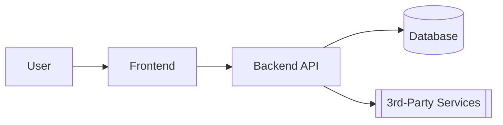

# Project Plan

Use this template to describe your project. Keep answers concise but specific. You can delete any sections you don’t need.

- Last updated: <YYYY-MM-DD>
- Owner: <name/role>
- Status: Draft | In Progress | Approved

---

## 1) Overview
- One-liner: <short description>
- Problem: <what problem are we solving?>
- Vision: <what does success look like in 3–6 months?>
- Elevator pitch: <2–3 sentences>

## 2) Goals and Non‑Goals
- Goals:
  - <measurable outcome>
  - <measurable outcome>
- Non‑Goals:
  - <explicitly out of scope>

## 3) Target Users and Personas
- Primary users: <roles/personas>
- Secondary users: <roles/personas>
- Pain points: <top 3>

## 4) Functional Requirements
List the capabilities the system must provide.
- FR1: <As a [user], I can [action] so that [benefit]>
- FR2: <...>

## 5) Non‑Functional Requirements (Quality Attributes)
- Performance: <e.g., p95 < 300ms>
- Availability: <e.g., 99.9%>
- Security/Privacy: <requirements>
- Scalability: <expected load and growth>
- Observability: <logs/metrics/traces>

## 6) Scope
- In Scope:
  - <features/areas>
- Out of Scope:
  - <features/areas>

## 7) System Architecture
Briefly describe the architecture. Add or replace the diagram below.

- Frontend: <framework>
- Backend: <language/framework>
- Database: <type>
- Messaging/Queues: <if any>
- File storage: <if any>

## 8) Tech Stack Preferences and Constraints
- Preferred languages/frameworks:
- Hosting/deployment targets:
- Compliance/regulatory constraints:
- Team expertise and constraints:

## 9) Data Model
- Entities: <User, Bet, Market, Odds, ...>
- Key fields and relationships:
- Data retention and archival:

## 10) APIs and Integrations
- External integrations: <provider, purpose, auth method>
- Internal APIs: <endpoints needed>
- Webhooks/callbacks: <events>

## 11) UI/UX
- Primary user flows:
  - <flow name>: steps 1…N
- Screens/pages:
  - <page name>: purpose + key components
- Accessibility considerations:

## 12) Milestones and Timeline
- M1: <description> — <target date>
- M2: <description> — <target date>
- Beta/Launch criteria: <entry/exit>

## 13) Risks and Assumptions
- Risks:
  - <risk> — Mitigation: <strategy>
- Assumptions:
  - <assumption>

## 14) Success Metrics (KPIs)
- Adoption: <e.g., DAU/WAU, sign‑up conversion>
- Reliability: <e.g., error rate, uptime>
- Performance: <e.g., p95 latency>
- Business: <e.g., revenue, churn>

## 15) Environments and Deployment
- Environments: <dev, staging, prod>
- CI/CD: <tooling and gating>
- Configuration/secrets: <how managed>
- Rollbacks: <process>

## 16) Security and Compliance
- AuthN/AuthZ model: <how users/roles are managed>
- Data classification: <PII/PHI/none>
- Threat model highlights: <top threats + mitigations>
- Auditing and logging: <what, where, retention>

## 17) Testing Strategy
- Unit tests: <scope and coverage goals>
- Integration tests: <key flows>
- E2E tests: <happy paths>
- Load/chaos testing: <if applicable>

## 18) Open Questions
- Q1: <question>
- Q2: <question>

## 19) Decision Log
Record key decisions to avoid re‑litigating.

| Date       | Decision | Context/Why | Owner |
|------------|----------|-------------|-------|
| YYYY‑MM‑DD | <...>    | <...>       | <...> |

## 20) References
- Links: <docs, tickets, prior art>
- Competitors/alternatives considered:

---

## Quickstart Summary (fill this block last)
- What we’re building: <one liner>
- For whom: <primary users>
- Why now: <reason>
- How we’ll build it: <stack + approach>
- How we’ll know it works: <top 3 KPIs>
